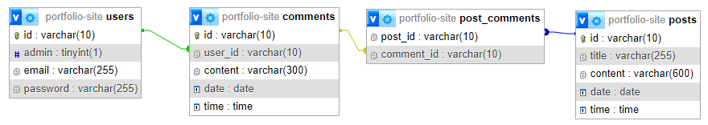
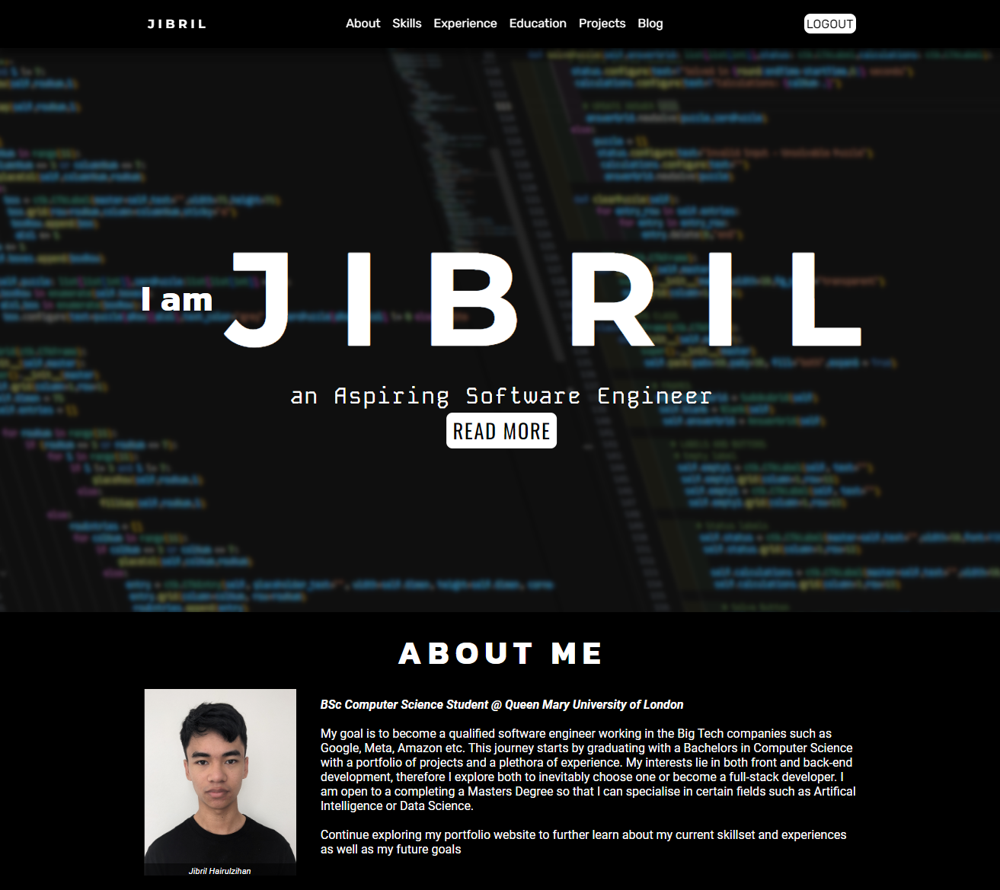
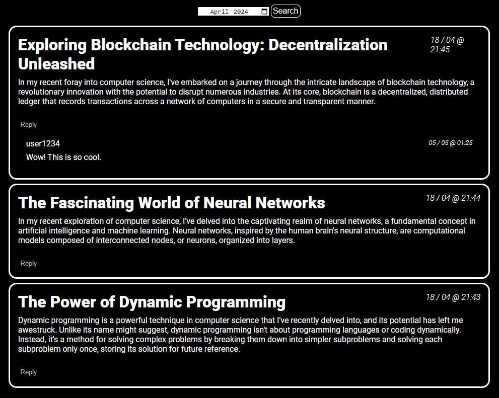
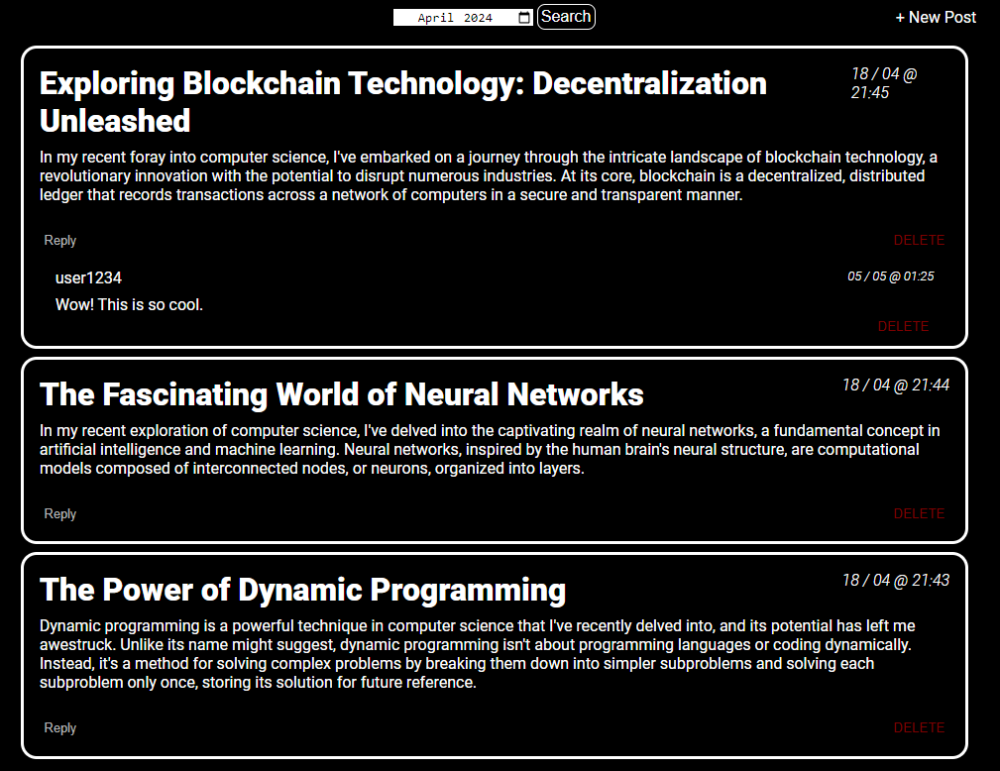
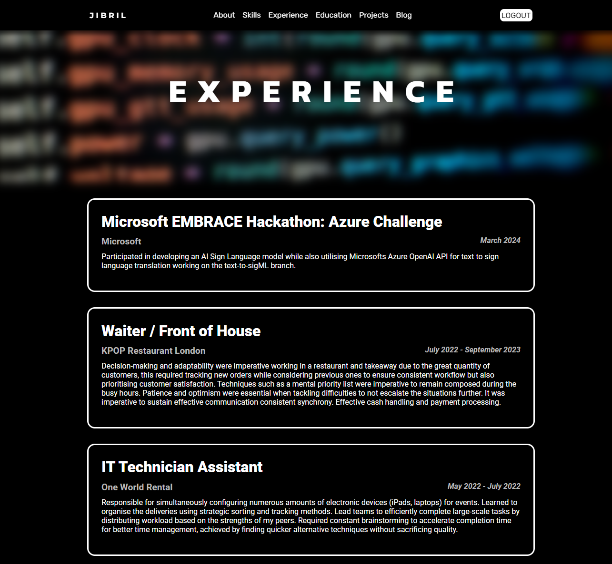

# Portfolio Website

The purpose of this repository was showcase my programming projects within a website. This website uses both client and server side processing. It is organised into different pages of my skills, experience, education, projects and a blog.

## Contents

1. [Noteable Features](#noteable-features)
2. [Database Structure](#database-structure)
3. [Demonstration](#demonstration)
   - [index.php](#index-page)
   - [viewBlog.php](#blog-page)

## Noteable Features

- Server Side driven Account System
- Third Normal Form Database storage
- Adding and deleting blog posts
- Adding and deleting comments linked to a blog post

## Database Structure

Users can either be of an _admin_ or _user_ status indicated by the Boolean admin field. All users can add comments which are linked to the respective posts via the `post_comments` table. Admins will be able to add and delete blog posts as well as deletion of comments.

## Demonstration

### Index Page

### Blog Page

 
Left image shows the page when logged in as a regular user, right images shows the page when logged in as an admin.

### Experience Page

